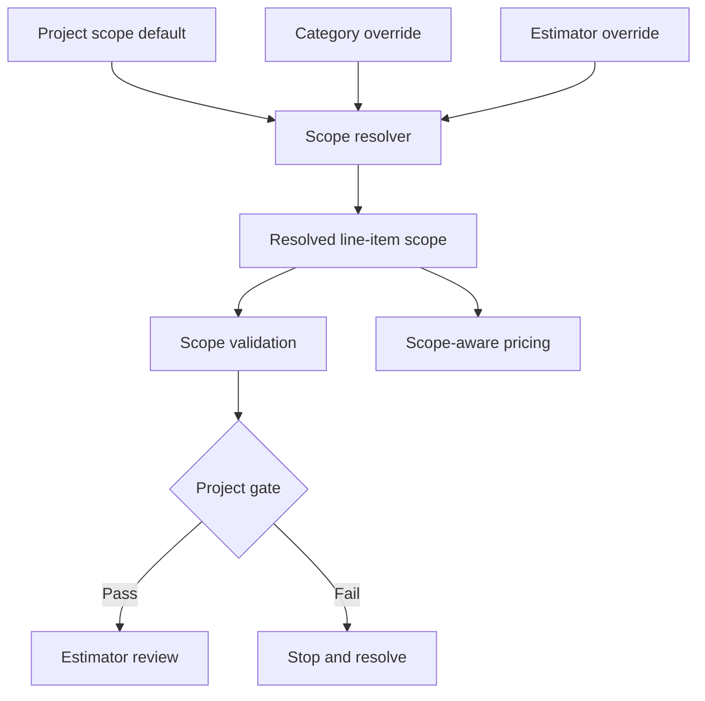

# Repository Map

## Purpose

The repository has two connected but not yet integrated systems:

1. An operational, spreadsheet-led bidding workflow.
2. A TypeScript foundation for deterministic scope resolution, validation, and pricing decisions.

The immediate engineering goal should be to connect them without weakening the estimator review gate.

## Top-level map

| Path | Role | Current state |
|---|---|---|
| `src/models/` | Typed scope, takeoff, and validation contracts | Active foundation |
| `src/config/` | Company-wide category exceptions | Active; requires controlled review as policy changes |
| `src/services/` | Scope resolution and scope-aware cost functions | Active and unit tested |
| `src/validation/` | Line-item and project-level validation gates | Active and unit tested |
| `scripts/check-scope.ts` | Executable sample validation | Smoke check only; not a production CLI |
| `tests/` | Resolver and pricing unit tests | Baseline coverage; no workbook integration tests |
| `bid-sheet/` | Current master bid workbook | Operational calculation artifact |
| `reference/` | Rates and bidding rules | Source of business rules; some rules await approval |
| `templates/` | Proposal and workbook templates | Inputs to future generation workflow |
| `completed-bids/` | Historical/calibration artifacts | Calibration process is not yet defined |
| `Drawings/` | Source drawing sets | Manual input; no ingestion pipeline |
| `Proposals/` | Generated client-facing artifacts | Output examples; generation is not automated |
| `SKILL.md` | Human/agent operating procedure and stop conditions | Primary workflow documentation |

## Current execution flow

The workbook and proposal artifacts currently sit outside this code path. No importer reads workbook rows into `TakeoffLine`, and no exporter writes validated results back to the workbook or proposal.

## Core invariants already encoded

- Explicit estimator/project scope overrides category rules.
- Category rules override the project-wide default.
- `TBD` scope cannot silently pass validation.
- Excluded work returns zero cost.
- Work not furnished, fabricated, or erected by Forged Ironworks is excluded from the corresponding calculation.
- Responsibility conflicts fail validation.
- Negative or non-finite pricing inputs are rejected.

## Material gaps and risks

| Priority | Gap | Risk |
|---|---|---|
| P0 | Workbook data is not connected to the typed code | Tests can pass while the operational workbook follows different logic |
| P0 | Several business rules remain unapproved | Automation could produce confidently wrong bids |
| P0 | Repository contains real project artifacts | Public exposure may leak business/customer information |
| P1 | No continuous-integration check existed at mapping time | Regressions could merge without typechecking or tests |
| P1 | Smoke script uses hard-coded sample rows | It proves wiring, not real-project correctness |
| P1 | No schema/version marker for workbook inputs | Workbook changes can silently break a future importer |
| P2 | Duplicate transitional config files remain | Future contributors may change the wrong file |
| P2 | Calibration ownership and update rules are undefined | Historical actuals cannot reliably improve rates |

## Recommended build order

1. Confirm the unresolved business rules with the estimator and record approval dates and owners.
2. Define a versioned workbook-row schema and build a read-only importer.
3. Validate imported rows and produce a machine-readable failure report; do not write bid totals yet.
4. Add golden-file tests using sanitized workbook fixtures.
5. Connect validated quantities to pricing and reconcile results against approved historical bids.
6. Add proposal generation only after the calculation path is reconciled and estimator approval remains mandatory.

## Foundation acceptance criteria

The repository baseline is healthy when:

- `npm ci` succeeds on a supported Node.js version.
- `npm run validate` passes.
- CI runs the same validation on pushes and pull requests.
- Documentation clearly distinguishes implemented code from spreadsheet workflow and future work.
- No unapproved rule is represented as settled company policy.
